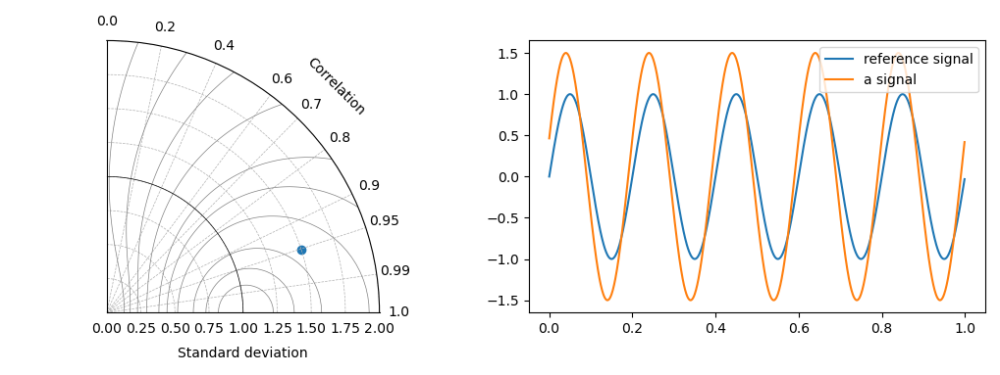

# Naive taylor diagram

This is a simple implementation to create [Taylor Diagrams]( https://doi.org/10.1029/2000JD900719) using python.

## Installation

```
git clone /https:the/webite/naive_taylor_diagram
cd naive_taylor_diagram
pip install .
```


Matplotlib and numpy are required. You can instal them by running:

`pip install numpy matplotlib`

## Usage
```
import numpy as np
import matplotlib.pyplot as plt
import naive_taylor_diagram.taylor_diagram as td

# -- synthetic data -- #
phase = np.pi/10  # phase difference between reference and synt_mes
magnt = 1.5  # magnitude factor
x = np.arange(0,1,0.001)
reference = np.sin(x*np.pi*10)  # 'reference'
synt_mesr = magnt*np.sin(x*np.pi*10+np.pi/10)  # 'measurement'


# -- taylor diagram -- #
fig = plt.figure(figsize=[10.2, 3.83])
ax1 = fig.add_subplot(121, projection='polar')
ax2 = fig.add_subplot(122)
ax1 = td.taylor(fig, ax=ax1)

# -- plot lines of skill or rmse -- #
ax1.contour(*td.skill_willmott_space(), linewidths=0.5, colors='0.5')
# ax1.contour(*td.rmse_space(), linewidths=0.5, colors='0.5')

# -- convert from cartesian to polar coordinates --
theta_corr = np.arccos(np.corrcoef(reference, synt_mesr)[0,1])
std0 = np.std(reference)
std1 = np.std(synt_mesr)

# -- divide by the radius standard deviation --
radius_stdn = std1/std0
ax1.scatter(theta_corr, radius_stdn)  # plot

# -- plot time series -- #
ax2.plot(x, reference, label='reference')
ax2.plot(x, synt_mesr, label='synthetic')
ax2.legend()

plt.tight_layout()
```


